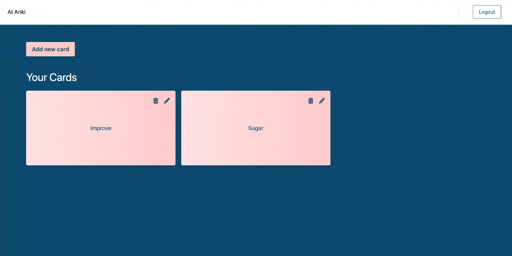

# AI Anki

You can create your own Anki deck with AI generated translation.

## Features

- Sign in / Login / Logout using Suapabase Auth
- Translate text using OpenAI
- Create Anki deck storing in Supabase
- Edit/Delete Anki card



## Tech stack

- Qwik
- Tailwind CSS
- Supabase
- OpenAI

## Get started

```
npm i
npm run dev
```
