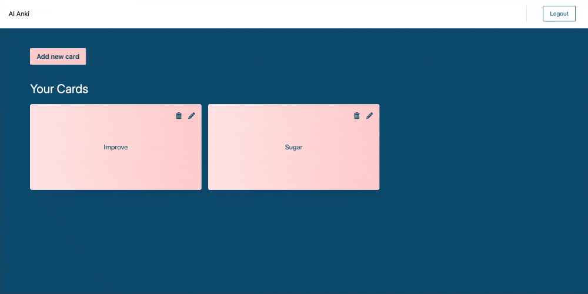

# AI Anki

Create flashcards with AI-assisted translations: sign in, add words, optionally translate with OpenAI, and manage cards stored in Supabase.

## Features

- Sign in / sign up / logout with **Supabase Auth** (email OTP / magic link flows in the app)
- **Translate** a word or phrase via OpenAI (`gpt-3.5-turbo` chat completions)
- **Cards** stored in Supabase (`profiles`, `cards` tables with Row Level Security)
- **Edit** and **delete** cards on the dashboard



## Tech stack

- [Qwik](https://qwik.dev/) & Qwik City (SSR / Vercel Edge adapter)
- [Vite](https://vitejs.dev/), TypeScript, Tailwind CSS
- [Supabase](https://supabase.com/) (Auth + Postgres)
- [OpenAI API](https://platform.openai.com/) (chat completions)

## Prerequisites

- **Node.js** ≥ 20.9 (Node 20.19+ or 22 LTS recommended for toolchain compatibility)
- A **Supabase** project (URL + anon key)
- An **OpenAI API key** with billing/quota enabled if you use translation (`insufficient_quota` means account billing or limits need attention on OpenAI’s side)

## Environment variables

Copy the example file and fill in real values:

```bash
cp .env.example .env
```

| Variable | Description |
|----------|-------------|
| `VITE_SUPABASE_URL` | Supabase project URL (Dashboard → Project Settings → API) |
| `VITE_SUPABASE_ANON_PUBLIC` | Supabase anon **public** key |
| `VITE_OPEN_AI_URL` | Usually `https://api.openai.com/v1/chat/completions` |
| `VITE_OPEN_AI_KEY` | OpenAI secret key (Dashboard → API keys; project keys preferred over legacy user keys) |

Because these names start with `VITE_`, they are included in the **browser bundle**. Do not treat `VITE_OPEN_AI_KEY` as a server-only secret; for production, consider calling OpenAI from a backend or edge function instead.

## Database (Supabase)

For a **new** project, create tables and policies by running the SQL migration once in the Supabase **SQL Editor**:

`supabase/migrations/20260510120000_cards_and_profiles.sql`

That script adds `profiles` and `cards`, enables RLS, and optionally creates a trigger to insert a profile row when a user signs up.

## Install & run

```bash
npm install
npm run dev
```

Open the URL shown in the terminal (default dev server with SSR).

### Other scripts

| Command | Purpose |
|---------|---------|
| `npm run build` | Production build (client + Vercel Edge server + typecheck + lint) |
| `npm run build.types` | TypeScript check only |
| `npm run lint` | ESLint |
| `npm run fmt` | Prettier write |

## Deploy

The repo includes a **Vercel Edge** adapter (`adapters/vercel-edge/`). Set the same `VITE_*` variables in your host’s environment. Example live app: [ai-anki.vercel.app](https://ai-anki.vercel.app/).
